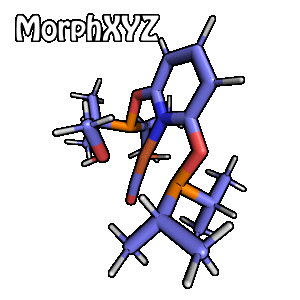

--Interpolate between two XYZ files--
###Usage
```bash
$ python morph.py --help

positional arguments:
  <start.xyz>           Start geometry of interpolation
  <stop.xyz>            Final geometry of interpolation

optional arguments:
  -h, --help            show this help message and exit
  -f str, --fname str   Filename of output morph xyz file (default: morphed.xyz)
  -d str, --dest str    Output directory (default: .)
  -n int, --nsteps int  Number of interpolation steps (default: 50)
  -o str, --origin str  Origin for alignment {centroid/com} (default: com)
  -l, --loop            Don't loop the morph back to start (default: true)
  -v, --verbose         Verbose output (default: false)
```
###Minimal Example
```bash
$ python morph.xyz start.xyz stop.xyz --loop
```

This will generate an XYZ file containing 
linearly interpolated geometries, morphed
from start to stop and back to start, both in
steps of 50.

###Details
The script first performs an alignment,
based on the Kabsch algorithm
(https://en.wikipedia.org/wiki/Kabsch_algorithm).
The alignment can be slightly tuned by
the choice of the origin of the optimal
rotation matrix. By default, center of
mass is used, but you can choose to use
the centroids instead.
        
The verbose flag prints out some key
objects, such as the covariance and
optimal rotation matrices from the 
alignment.

###Caveats
These are currently some limitations or unwanted
behavior:
- Start and stop geometries MUST have the same
  number of atoms.
- Start and stop geometries MUST be in XYZ file format.
- Atoms in start and stop should match in a 
  pair-wise manner, for optimal morphs 
  (line 1 in start should correspond to line 1 in stop, and so on). If this is
  not the case, then weird transitions may
  take place (e.g., H atom in start becomes C atom
  in stop, but the visualizing software is not able
  to tell, so the representation stays like an H atom).
  
###Author
Anders Brakestad
PhD Candidate in Computational Chemistry
University of Tromsø The Arctic University of Norway
